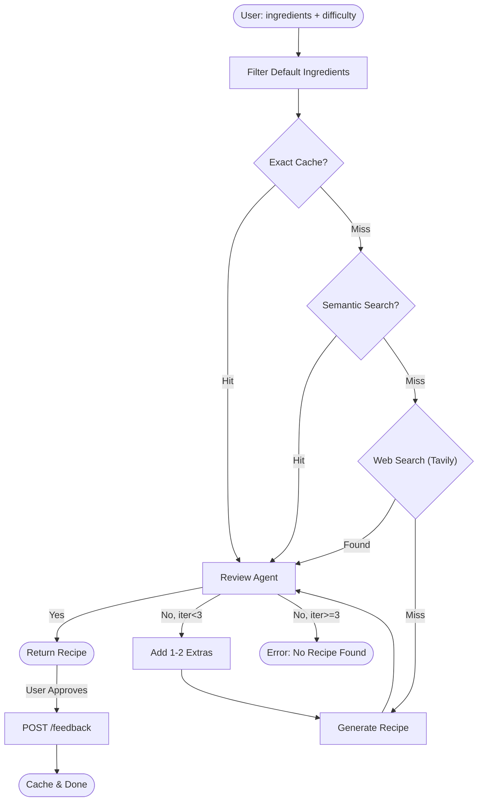

# 🍳 Chestia

**Chestia** is an intelligent, premium culinary platform that generates high-quality recipes from user-provided ingredients. It leverages a sophisticated multi-agent AI system with Google Gemini to ensure accuracy, safety, and an exceptional user experience.

---

## ✨ Features

- **Smart Web Search**: Integrates Tavily AI to find real-world recipes before attempting LLM generation
- **AI-Powered Recipe Generation**: Leverages Google Gemini (1.5 Flash) to craft recipes based on what you have in your fridge
- **Difficulty-Based Recipes**: Choose Easy, Intermediate, or Hard to get recipes that match your cooking skills
- **Smart Default Ingredients**: Automatically assumes basic pantry staples (water, oil, salt, spices) are available
- **Auto-Retry with Suggestions**: If a recipe can't be made with your ingredients, the system automatically tries adding 1-2 extras (max 3 attempts)
- **Hallucination Control**: Verification agents ensure recipes are logically sound and don't include imaginary ingredients
- **Smart Caching**: Approved recipes are stored in SQLite. It uses dual-layer retrieval:
  - **Exact Cache Check**: Instant hit for identical ingredient lists.
  - **Semantic Search**: Fuzzy matching via vector embeddings (Gemini + `sqlite-vec`) for variations like "fusilli" vs "pasta".
- **Recipe Modification**: Don't like the result? Request a new version or add ingredients via `/modify` endpoint
- **Bilingual Support**: Full Turkish/English support for all API messages
- **Premium Design**: Dark-mode focused experience built with Next.js and Tailwind CSS v4

---

## 🏗️ Architecture

### High-Level Flow



### Multi-Agent System

The backend orchestrates three specialized AI agents using LangGraph:

1. **RecipeAgent** (`recipe_agent.py`)
   - Generates recipes using Google Gemini 1.5 Flash (temperature: 0.7)
   - Enforces strict ingredient constraints
   - Adjusts complexity based on difficulty level

2. **SearchAgent** (`search_agent.py`)
   - Performs web searches using Tavily AI
   - Finds existing recipes to avoid unnecessary generation
   - Extracts relevant cooking information for the RecipeAgent

3. **ReviewAgent** (`review_agent.py`)
   - Validates recipes using Google Gemini 1.5 Flash (temperature: 0)
   - Checks for hallucinations and logical errors
   - Verifies difficulty appropriateness
   - Suggests additional ingredients if needed

4. **Orchestration** (`graph.py`)
   - Coordinates agent interactions via LangGraph
   - Manages auto-retry flow (max 3 iterations)
   - Handles state and error propagation

---

## 🛠️ Tech Stack

### Backend

- **Language**: Python 3.14
- **Orchestration**: LangGraph + CrewAI
- **LLM**: Google Gemini 1.5 Flash (via `langchain-google-genai`)
- **API Framework**: FastAPI + Uvicorn
- **Database**: SQLite with `sqlite-vec` extension for vector search
- **Testing**: pytest (70 unit and integration tests)
- **Utilities**:
  - `config.py`: Default ingredient filtering
  - `database.py`: SQLite operations & caching
  - `utils/i18n.py`: Bilingual message management

### Frontend

- **Framework**: Next.js 16 (App Router)
- **Styling**: Tailwind CSS v4 + Lucide React
- **Passive Bridge**: CopilotKit (planned integration)
- **State Management**: React Hooks & Zod for validation

---

## 📂 Project Structure

```text
.
├── chestia-backend/              # Python Multi-Agent Backend
│   ├── src/
│   │   ├── agents/               # AI Agents
│   │   │   ├── recipe_agent.py   # Recipe generation agent
│   │   │   ├── review_agent.py   # Validation & review agent
│   │   │   └── search_agent.py   # Web search agent
│   │   ├── utils/
│   │   │   └── i18n.py           # Bilingual message utility
│   │   ├── api.py                # FastAPI endpoints
│   │   ├── graph.py              # LangGraph orchestration
│   │   ├── database.py           # SQLite operations
│   │   ├── config.py             # Default ingredients config
│   │   └── chestia.db            # SQLite database
│   ├── tests/                    # Test suite (8 files)
│   │   ├── test_integration.py   # End-to-end flow tests
│   │   ├── test_api.py           # API endpoint tests
│   │   ├── test_agents.py        # Agent behavior tests
│   │   ├── test_graph.py         # Graph orchestration tests
│   │   └── ...                   # Additional test files
│   └── requirements.txt          # Python dependencies
├── chestia-web/                  # Next.js Frontend
│   ├── app/                      # Next.js App Router
│   ├── components/               # Reusable UI components
│   └── package.json              # Dependencies & Scripts
├── docs/                         # Technical documentation
│   └── chestia-backend-integration-tests.md
└── GEMINI.md                     # Project Rules & Standards
```

---

## 🚀 Getting Started

### Prerequisites

- Python 3.14+ (or 3.12+)
- Node.js 25+ (for frontend)
- Google Gemini API key ([Get one here](https://makersuite.google.com/app/apikey))

### Backend Setup

1. **Navigate to the backend directory:**

   ```bash
   cd chestia-backend
   ```

2. **Create and activate a virtual environment:**

   ```bash
   python -m venv venv
   source venv/bin/activate  # On Windows: venv\Scripts\activate
   ```

3. **Install dependencies:**

   ```bash
   pip install -r requirements.txt
   ```

4. **Configure environment variables:**
   Create a `.env` file in the `chestia-backend` directory:

   ```env
   GOOGLE_API_KEY=your_gemini_api_key_here
   TAVILY_API_KEY=your_tavily_api_key_here
   ```

5. **Run the development server:**

   ```bash
   uvicorn src.api:app --reload
   ```

   The API will be available at `http://localhost:8000`

6. **Run tests (optional):**

   ```bash
   pytest tests/ -v
   ```

### Frontend Setup

1. **Navigate to the web directory:**

   ```bash
   cd chestia-web
   ```

2. **Install dependencies:**

   ```bash
   npm install
   ```

3. **Run the development server:**

   ```bash
   npm run dev
   ```

   The app will be available at `http://localhost:3000`

---

## 📡 API Endpoints

### Generate Recipe

`POST /generate`

**Request:**

```json
{
  "ingredients": ["chicken", "rice", "onion"],
  "difficulty": "easy",
  "lang": "en"  // "tr" for Turkish
}
```

**Response (Success):**

```json
{
  "status": "success",
  "recipe": {
    "name": "Simple Chicken Rice",
    "ingredients": ["chicken", "rice", "onion", "salt", "oil"],
    "steps": ["Step 1...", "Step 2..."],
    "metadata": {"cooking_time": "30 min"}
  },
  "extra_ingredients_added": [],
  "iterations": 1
}
```

**Response (Error):**

```json
{
  "status": "error",
  "message": "No suitable recipe could be found...",
  "extra_ingredients_tried": ["garlic", "tomato"]
}
```

### Modify Recipe

`POST /modify`

**Request:**

```json
{
  "original_ingredients": ["chicken", "rice", "onion"],
  "new_ingredients": ["tomato"],
  "difficulty": "intermediate",
  "modification_note": "make it spicy",
  "lang": "en"
}
```

### Submit Feedback

`POST /feedback`

**Request:**

```json
{
  "ingredients": ["chicken", "rice", "onion"],
  "difficulty": "easy",
  "approved": true,
  "recipe": { /* recipe object */ },
  "lang": "en"
}
```

---

## � Testing

The backend includes comprehensive test coverage:

- **Integration Tests** (`test_integration.py`): End-to-end flow with mocked LLM responses
- **API Tests** (`test_api.py`): Endpoint validation
- **Agent Tests** (`test_agents.py`, `test_review_agent.py`): Agent behavior verification
- **Graph Tests** (`test_graph.py`): Orchestration flow
- **Database Tests** (`test_database.py`): SQLite operations
- **Configuration Tests** (`test_config.py`): Default ingredient filtering

Run all tests:

```bash
cd chestia-backend
pytest tests/ -v
```

Run specific test suite:

```bash
pytest tests/test_integration.py -v
```

---

## 🤖 CopilotKit Integration

CopilotKit serves as the **bridge** between the frontend and the agentic backend, enabling a rich AI user experience.

### Architecture

1. **Remote Endpoint**: The backend exposes a strictly typed CopilotKit endpoint at `/copilotkit`.
2. **LangGraph Adapter**: A specialized wrapper (`copilotkit_agent.py`) adapts the internal LangGraph workflow to the AG-UI protocol.
3. **State Management**: CopilotKit manages the conversation state (`messages`, `ingredients`, `recipe`) and synchronizes it between frontend and backend.
4. **Passive Execution**: The frontend does not generate recipes; it acts as a UI layer for the backend intelligence.

### Integration Points

- **Endpoint**: `POST /copilotkit` (Handled by CopilotKit SDK)
- **Agent Name**: `chestia_recipe_agent`
- **Output**: JSON-structured recipes compatible with the frontend UI components

---

## 📜 Development Guidelines

- **TDD (Test-Driven Development)**: Write failing tests before any implementation
- **Bilingual i18n**: Use `src/utils/i18n.py` for all user-facing backend messages
- **Safety First**: All recipes must pass the hallucination check before being stored
- **Strict Ingredient Control**: Filter default ingredients at the API level
- **Architecture Standards**: Refer to [GEMINI.md](GEMINI.md) for project rules and coding standards

---

## 🔒 Security & Configuration

- **API Key Management**: Store sensitive keys in `.env` (never commit!)
- **Input Validation**: All ingredients are sanitized with regex validation
- **Error Masking**: Server errors are masked in production responses
- **Turkish Character Support**: Validation regex supports Turkish characters (ğ, ü, ş, ı, ö, ç)

---

## 📝 License

This project is private and proprietary.

---

*Chestia - Elevating your culinary journey with AI.*

---
*Last reviewed: 2026-01-28*
