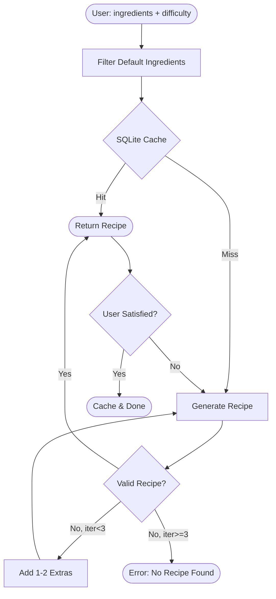

# 🍳 Chestia

**Chestia** is an intelligent, premium culinary platform designed to generate high-quality recipes from user-provided ingredients. It uses a sophisticated multi-agent system to ensure accuracy, safety, and a "wow" user experience.

---

## ✨ Features

- **AI-Powered Recipe Generation**: Leverages Google Gemini to craft recipes based on what you have in your fridge.
- **Difficulty-Based Recipes**: Choose Easy, Intermediate, or Hard to get recipes that match your cooking skills.
- **Smart Default Ingredients**: Automatically assumes basic pantry staples (water, oil, salt, spices) are available.
- **Auto-Retry with Suggestions**: If a recipe can't be made with your ingredients, the system automatically tries adding 1-2 extras (max 3 attempts).
- **Hallucination Control**: Verification agents ensure recipes are logically sound and don't include imaginary ingredients.
- **Smart Caching**: Approved recipes are stored in SQLite (difficulty + ingredients as key) for instant repeat requests.
- **Recipe Modification**: Don't like the result? Request a new version or add ingredients via `/modify` endpoint.
- **Premium Design**: Dark-mode focused experience built with Next.js and Tailwind CSS v4.

---

## 🏗️ Architecture



---

## 🛠️ Tech Stack

### Backend
- **Language**: Python v3.14
- **Orchestration**: LangGraph, CrewAI
- **LLM**: Google Gemini (via `langchain-google-genai`)
- **API**: FastAPI, Uvicorn
- **Database**: SQLite

### Frontend
- **Framework**: Next.js 16 (App Router)
- **Styling**: Tailwind CSS v4, Lucide React
- **Passive Bridge**: CopilotKit (Planned Integration)
- **State Management**: React Hooks & Zod for validation

---

## 📂 Project Structure

```text
.
├── chestia-backend/         # Python Multi-Agent Backend
│   ├── src/                 # Source code (agents, api, graph)
│   ├── tests/               # Pytest suite
│   └── requirements.txt     # Dependencies
├── chestia-web/             # Next.js Frontend
│   ├── app/                 # Next.js App Router
│   ├── components/          # Reusable UI components
│   └── package.json         # Dependencies & Scripts
├── docs/                    # Technical documentation & PRD
└── GEMINI.md                # Project Rules & Standards
```

---

## 🚀 Getting Started

### Backend Setup

1.  Navigate to the backend directory:
    ```bash
    cd chestia-backend
    ```
2.  Create and activate a virtual environment:
    ```bash
    python -m venv venv
    source venv/bin/activate
    ```
3.  Install dependencies:
    ```bash
    pip install -r requirements.txt
    ```
4.  Configure environment variables:
    Create a `.env` file and add your `GOOGLE_API_KEY`:
    ```env
    GOOGLE_API_KEY=your_gemini_api_key_here
    ```
5.  Run the development server:
    ```bash
    uvicorn src.api:app --reload
    ```

### Frontend Setup

1.  Navigate to the web directory:
    ```bash
    cd chestia-web
    ```
2.  Install dependencies:
    ```bash
    npm install
    ```
3.  Run the development server:
    ```bash
    npm run dev
    ```

---

## 🤖 CopilotKit Process (Planned)

CopilotKit will be integrated as a **passive bridge** between the frontend and the agentic backend.

1.  **Strict Relay**: The frontend will forward user ingredient inputs via CopilotKit.
2.  **State Synchronization**: CopilotKit will manage the conversation state and specific "Human-in-the-Loop" interactions (approving/rejecting extra ingredients).
3.  **No Local Generation**: All intelligence resides in the backend; the frontend focuses strictly on presentation and relaying responses.

---

## 📜 Development Guidelines

- **TDD (Test-Driven Development)**: Write failing tests before any implementation.
- **Safety First**: All recipes must pass the hallucination check before being stored.
- **Rules**: Refer to [GEMINI.md](file:///Users/denizb/Repos/Chestia/GEMINI.md) for architectural and coding standards.

---

*Chestia - Elevating your culinary journey with AI.*
