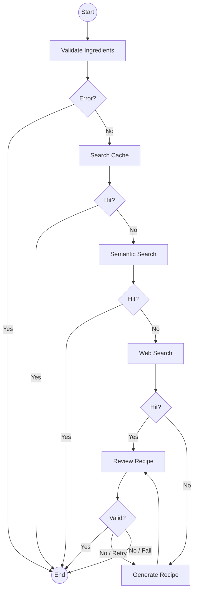

# Chestia Backend Infrastructure & Architecture

This document provides a comprehensive overview of the **Chestia** backend infrastructure, its multi-agent architecture, and detailed integration guides for the front-end team.

## 1. System Overview

Chestia is a high-end culinary intelligence platform that generates professional recipes based on user-provided ingredients. It employs a **Multi-Agent System (MAS)** built with **LangGraph** to ensure high-quality, validated, and hallucination-free recipe generation.

### Key Features

- **Intelligent Ingredient Validation**: Filtering of default household ingredients (salt, water, oil).
- **Multi-Level Search Strategy**:
    1. **Exact Cache**: SQLite lookup for identical requests.
    2. **Semantic Search**: Vector similarity search using `sqlite-vec` to find similar existing recipes.
    3. **Web Search**: Real-time discovery via Tavily AI.
- **Agentic Generation**: LLM-based generation with a built-in **Review & Retry** loop.
- **Localization**: Full support for English (`en`) and Turkish (`tr`).

## 2. Infrastructure Stack

- **Backend Framework**: [FastAPI](https://fastapi.tiangolo.com/) (Python 3.14)
- **Orchestration**: [LangGraph](https://langchain-ai.github.io/langgraph/) for stateful, cyclic agent workflows.
- **LLM Engine**: Google Gemini (via `langchain-google-genai`).
- **Database**:
  - **SQLite**: Relational storage for recipes and logs.
  - **sqlite-vec**: High-performance vector extension for semantic retrieval.
- **Integration Layer**: [CopilotKit](https://www.copilotkit.ai/) for seamless AI-to-Frontend communication.
- **Search API**: [Tavily AI](https://tavily.com/) for real-time culinary web search.

## 3. Architecture & Workflow

The core logic resides in a LangGraph workflow defined in [graph.py](file:///Users/denizb/Repos/Chestia/chestia-backend/src/workflow/graph.py).

### Workflow Diagram



### Agent Roles

| Agent | Responsibility |
| :--- | :--- |
| **ValidationAgent** | Normalizes difficulty levels and ensures ingredients are safe/valid. |
| **SearchAgent** | Queries the web for authentic recipes when local storage lacks results. |
| **RecipeAgent** | Orchestrates the LLM to construct a recipe following strict ingredient constraints. |
| **ReviewAgent** | Acts as a "Quality Gate," validating the recipe against the original ingredients. |

## 4. Frontend Integration Guide

The frontend integrates via standard REST endpoints or through the CopilotKit bridge.

### 4.1 REST API Reference

#### **POST `/api/generate`**

Generates a new recipe from a list of ingredients.

**Request Payload:**

```json
{
  "ingredients": ["chicken breast", "broccoli", "soy sauce"],
  "difficulty": "intermediate",
  "lang": "en"
}
```

- `ingredients`: Minimum 3, Maximum 20.
- `difficulty`: `easy`, `intermediate`, or `hard`.
- `lang`: `en` or `tr` (defaults to `en`).

**Response (Success):**

```json
{
  "status": "success",
  "recipe": {
    "name": "Soy Glazed Chicken with Broccoli",
    "ingredients": ["chicken breast", "broccoli", "soy sauce", "salt", "oil"],
    "steps": ["Step 1...", "Step 2..."],
    "metadata": {"time": "25min", "difficulty": "intermediate"}
  },
  "source_node": "generate",
  "extra_ingredients_added": []
}
```

#### **POST `/api/modify`**

Regenerates or modifies a recipe with new constraints.

**Request Payload:**

```json
{
  "original_ingredients": ["chicken", "broccoli"],
  "new_ingredients": ["garlic"],
  "difficulty": "easy",
  "lang": "en"
}
```

#### **POST `/api/feedback`**

Submits user approval/rejection for a recipe to optimize caching.

**Request Payload:**

```json
{
  "ingredients": ["chicken", "broccoli"],
  "difficulty": "intermediate",
  "approved": true,
  "recipe": { ... },
  "lang": "en"
}
```

### 4.2 Error Handling

| Status Code | Description | Recommended UI Action |
| :--- | :--- | :--- |
| `422 Unprocessable Entity` | Validation failed (e.g., < 3 ingredients). | Show validation error message to user. |
| `429 Too Many Requests` | Rate limit exceeded (5req/min). | Show "Too many attempts" and implement cooldown. |
| `500 Internal Server Error` | Unexpected backend failure. | Show generic "Unable to process" message. |

> [!IMPORTANT]
> The backend implements a 3-retry logic internally. If the API returns an error after these retries, the frontend should display: *"Currently unable to process your transaction."*

## 5. Security & Performance

- **Rate Limiting**: Implemented via `slowapi` on `/generate`, `/modify`, and `/feedback`.
- **CORS**: Configured to allow specific origins in production (currently `*` for development).
- **Security Headers**: Automatic injection of `X-Frame-Options`, `Content-Security-Policy`, and `Strict-Transport-Security`.
- **Database Indexing**: Semantic search enables fast retrieval of "close matches," reducing LLM costs and latency.

---
*For further technical details, refer to the [src](file:///Users/denizb/Repos/Chestia/chestia-backend/src) directory.*
